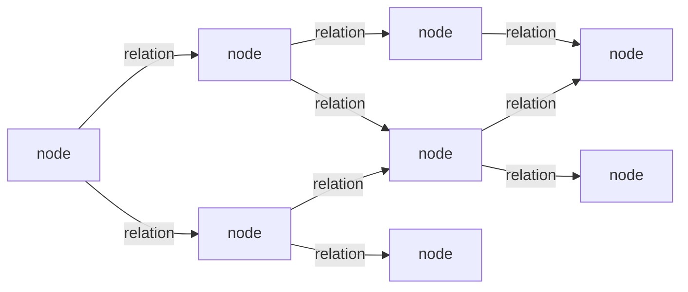

# PathHydra

PathHydra is designed to store knowledge as nodes and typed, directed relations,
then find the closest logical region of that graph for the current context.

Confirmed records remain authoritative in RocksDB. The engine compiles them through a consistent streaming scan into a deterministic, checksummed five-file routing bundle. Startup validates and reuses the referenced bundle, or clears it and rebuilds when it is absent or corrupt. Small topology uses the fully resident CPU path; topology above `max_active_image_bytes` uses exact out-of-core CPU routing through bounded source-segment partitions and a shared host cache. Dense identity/directory metadata and per-search state retain separate explicit limits.

Context-weighted pathfinding exposes exact distances and, when requested, the paths that produced them. Those results can support branching graph structures without the Rust engine imposing one composition strategy:



The Rust engine can perform exact selection on NVIDIA CUDA with either complete
topology residency or bounded source-segment partitions. When paths are
requested, CUDA selects exact distances and the acquired CPU image supplies
verified edge evidence. Hydration and caller-owned subgraph composition remain
host operations.

## Core model

- **Node:** a thing, concept, event, claim, or value.
- **Relation:** a typed, directed connection between two nodes.
- **Logical distance:** the accumulated context-adjusted weight used during graph selection.
- **Routing result:** exact destination distances and optional path identities.
- **Subgraph:** a caller-owned set of node and relation handles assembled through the Rust API.
- **Hydration:** turning caller-specified node and relation handles into complete records.

## Direction

PathHydra is intended to provide:

- typed graph storage;
- constrained exact CPU and NVIDIA CUDA pathfinding;
- exact context-weighted routing;
- structurally safe subgraph construction;
- traceable inference results;
- a clean boundary between stored facts and inferred conclusions.

PathHydra has one current pre-release API, durable layout, routing-bundle
layout, and canonical DTO representation. They carry no compatibility or
migration promise before the first public release.

## Implementation status

The complete CPU-side Rust engine now provides a durable graph store. It preserves
opaque node payloads; exact node and relation-kind names; provisional node,
relation-kind, and edge candidates; and confirmed typed, directed edges with
canonical base weights. Promotion and deletion are atomic, parallel and self-edges
have independent identities, node deletion cascades through both adjacency
directions. Startup validates every confirmed record and index relationship.

The routing crate compiles one consistent confirmed-graph read into an
immutable in-memory CSR image and performs deterministic exact CPU routing.
Explicit relation profiles can disable relation kinds or adjust their logical
weights, one search serves many destinations, budgets produce inspectable
incomplete results, and optional paths preserve stable edge identities and
weight evidence. `GraphEngine` owns current-image publication, bounded and
cancellable synchronous CPU execution, current-record and exact-path hydration,
caller-owned deterministic subgraphs, capabilities, health, and recovery from
post-commit image-build failure. The current boundaries are documented in
[the storage-format reference](docs/storage-format.md) and
[the routing-image reference](docs/routing-image.md), with engine behavior in
[the CPU-engine reference](docs/cpu-engine.md).

The optional `cuda` feature adds Rust-authored `sm_86` PTX loaded through the
CUDA Driver API, immutable resident and partition-cached topology, exact
frontier and delta-stepping distance routing, independent queued lanes, memory
admission, CPU fallback, health, and explicit recovery. Unlimited-budget path
requests use CUDA distance selection followed by a cancellation-aware CPU
evidence pass on the same image or bundle lease; distance states must agree
bit-for-bit before evidence is returned. Finite examined-edge budgets remain a
CPU-only shape under permissive policies and a typed refusal under `RequireCuda`.
The local RTX 3080 baseline does not justify automatic acceleration, so `Auto`
remains conservative and no universal speedup is claimed. See [the CUDA build
guide](docs/cuda-build.md), [routing contract](docs/cuda-routing.md), and
[operations guide](docs/cuda-operations.md).

The selected consumer boundary is the synchronous in-process
`pathhydra-api::PathHydra` facade with owned DTOs, process-local request handles,
typed cancellation, bounded canonical JSON, current-state hydration, durable
operations, and explicit shutdown. BAML application design remains outside the
engine; no network transport is required or implied. See the
[consumer API reference](docs/consumer-api.md).

Operational selection uses independent limits. `max_active_image_bytes`
selects resident versus partitioned CPU topology; host metadata,
partition-cache, I/O queue/staging, retirement, CUDA device-cache, CUDA staging,
and per-search reservations each have their own fields. `PreferCuda` reruns a
complete eligible request on the matching CPU bundle after a device failure.
`RequireCuda` returns the typed CUDA refusal instead. `Auto` remains
conservative and does not infer a speedup from topology size alone.

On startup, the default policy validates and reuses the durable pointer or
rebuilds an absent/corrupt bundle from confirmed RocksDB records. Set
`StartupBundlePolicy::RequireValidBundle` to refuse that automatic rebuild.
Operators can call `rebuild_routing_image`, `rebuild_cuda_residency`, or
`reinitialize_cuda` explicitly. Routing bundles are rebuildable indexes and
may be omitted from backups; confirmed RocksDB records remain the sole durable
graph source of truth.

## Development

Building `pathhydra-store` requires a C++ toolchain and LLVM/libclang because
the RocksDB binding compiles native code and generates bindings. On Windows,
ensure LLVM's `bin` directory is on `PATH` (or set `LIBCLANG_PATH`).
If the `librocksdb-sys` build helper exits with `STATUS_DLL_NOT_FOUND`, ensure
the selected LLVM installation's `libclang.dll` and its native runtime are
discoverable on `PATH`; this is a toolchain startup failure, not a graph-store
failure.

Run the authoritative local checks from the repository root:

```powershell
cargo fmt --all --check
cargo check --workspace --all-targets
cargo clippy --workspace --all-targets -- -D warnings
cargo test --workspace
powershell -NoProfile -File Scripts/generate-dependency-inventory.ps1 -Check
powershell -NoProfile -File Scripts/check-system-conformance.ps1
```

CUDA-capable development additionally uses the explicitly installed pinned
nightly described in `docs/cuda-build.md`; runtime deployment needs a compatible
NVIDIA driver but not the CUDA toolkit.

The [system conformance ledger](docs/system-conformance.md) maps the normative
system shape to current code, decisions, tests, and operational evidence. The
[dependency reference](docs/dependencies.md) records pinned Rust licences and
the manually reviewed native/toolchain boundary.
