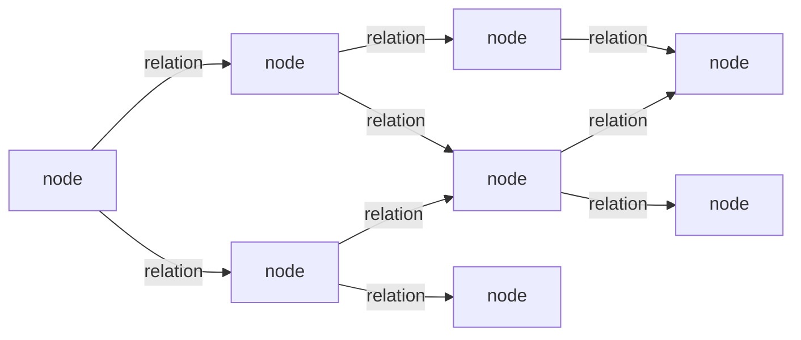

# PathHydra

PathHydra is designed to store knowledge as nodes and typed, directed relations,
then find the closest logical region of that graph for the current context.

Context-weighted pathfinding exposes exact distances and, when requested, the paths that produced them. Those results can support branching graph structures without the Rust engine imposing one composition strategy:



The long-term goal is to perform that selection in parallel on the GPU and return the hydrated subgraph with every included connection available for inspection.

## Core model

- **Node:** a thing, concept, event, claim, or value.
- **Relation:** a typed, directed connection between two nodes.
- **Logical distance:** the accumulated context-adjusted weight used during graph selection.
- **Routing result:** exact destination distances and optional path identities.
- **Subgraph:** a caller-owned, version-pinned set of node and relation handles assembled through the Rust API.
- **Hydration:** turning caller-specified node and relation handles into complete records.

## Direction

PathHydra is intended to provide:

- typed graph storage;
- constrained, GPU-accelerated pathfinding;
- exact context-weighted routing;
- version-safe subgraph construction;
- traceable inference results;
- a clean boundary between stored facts and inferred conclusions.

The project is in its early design stage. Interfaces and storage formats are not yet stable.

## Implementation status

The Rust core now provides durable exact-name catalogs for node identities and
relation kinds. It supports provisional candidates, atomic confirmation,
case-sensitive exact lookup, stable numeric IDs, graph-version increments, and
validated in-memory index rebuilding after a RocksDB restart. Names are stored
exactly; no trimming, case folding, Unicode normalization, or aliasing occurs.

Edges, payloads, deletion, routing, GPU acceleration, hydration, and
caller-owned subgraph composition are not implemented yet. The catalog's
version 1 layout is documented in
[the storage-format reference](docs/storage-format.md).

## Development

Building `pathhydra-store` requires a C++ toolchain and LLVM/libclang because
the RocksDB binding compiles native code and generates bindings. On Windows,
ensure LLVM's `bin` directory is on `PATH` (or set `LIBCLANG_PATH`).

Run the authoritative local checks from the repository root:

```powershell
cargo fmt --all --check
cargo check --workspace --all-targets
cargo clippy --workspace --all-targets -- -D warnings
cargo test --workspace
```

## Build plans

- [Project scaffolding](docs/plans/00-project-scaffolding.md)
- [First core slice: exact identity catalog](docs/plans/01-exact-identity-catalog.md)
